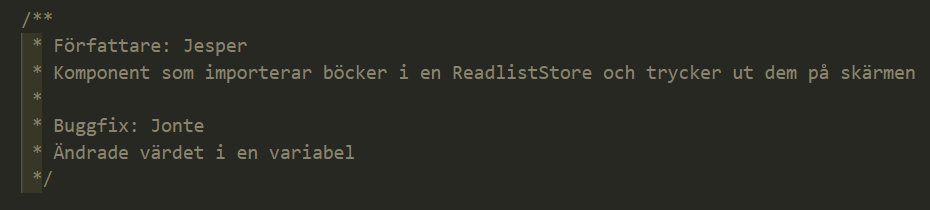

# Take Away-restaurangen

## Länkar

* [User Stories](https://github.com/users/Santosnr6/projects/21)
* [Tidsbokningar](https://docs.google.com/spreadsheets/d/1E0R8hO6KOydRr7Hrp391vpUyA1T0rHuQR6SO8B8WHQg/edit?usp=sharing)
* [Examinationsresurser](https://github.com/fu-fullstack-fe24/exam-group-project-resources/tree/main) (här kommer jag klistra in lektionskod, filmer och andra resurser ni kommer kunna ha nytta av de kommande veckorna)
* [Intro till gruppexamination]()

## Inledning

*“Välkommen till vårt kreativa kök!”*

Tänk er det här: ni har precis fått ett samtal från ett spännande nystartat företag som har en vision om att revolutionera take away-marknaden för restauranger. De är trötta på det gamla vanliga, och nu vill de slå på stort – och det är här ni kommer in i bilden! Er uppgift? Skapa ett grymt koncept som får kunderna att trycka på “beställ” innan de ens hunnit blinka!

Ni kommer att ansvara för att bygga hela varumärket från grunden. Det innebär att ni hittar på ett namn som folk kommer att minnas, en visuell identitet som gör att restaurangen står ut i mängden, och en webbsida där kunder enkelt kan beställa sina favoriträtter. Men inte nog med det! På insidan behöver restaurangen ett smidigt system där de anställda kan hantera menyn, ordrar och allt annat som gör att matlagningen kan rulla på utan krångel.

Det här är er chans att kombinera era talanger inom kreativt tänkande, webbdesign och systemutveckling – och självklart att ha kul medan ni gör det!

## Specifikationer

Som ert examinerande fullstackprojekt skall ni bygga en webbsida för en restaurang som uteslutande erbjuder take away-servering.

Ni bestämmer själva restaurangens namn, tema, grafiska profil, samt vilken sorts mat och dryck som serveras. 

Restaurangens kunder skall kunna använda webbsidan för att:
* Läsa menyn
* Göra en take away-beställning
* Ändra eller ångra en lagd beställinng (innan den är låst av personalen)
* Få information om restaurangen

Restaurangens anställda skall kunna använda webbsidan för att:
* Se inlagda beställningar
* Se vilka beställningar som ännu inte behandlats
* Låsa en beställning när den skickas till köket så att den inte kan ändras eller ångras
* Ändra detaljer i en beställning
* Lägga med en kommentar i bestälningen (till kocken)

Ni har alltså två olika sorters användare: **kunder** och **anställda**. Kom ihåg att dessa två användargrupper har olika behov! Ni hittar User Stories för projektet längre upp under rubriken **Länkar**. Antingen behåller ni dessa som de är, eller så bryter ni ner dem i mindre "tasks" för er Product Backlog.
Tänk på att detta projekt kan användas för att söka LIA eller jobb i framtiden, så se till att lägga ner ett ordentligt arbete!

## Innehåll

Detta projekt kommer kombinera allt som ni har lärt er i utbildningen hittills:
* Arbeta agilt enligt Scrum
* Designprocessen
* Git och GitHub
* HTML & CSS, responsiv design
* React
* AWS serverless framework / Express.js
* AWS S3 bucket

### Scrum

Ni ska följa Scrum-metoden till punkt och pricka genom hela utvecklingsprocessen. Detta innebär **sprint planning**, **daily scrum** varje dag ni arbetar med projektet, **sprint review** och **sprint retrospective** (Ni skall anteckna från planning, review och retrospective, för att kunna skriva om detta i rapporten).

Under kursen har ni handledningstid under ordinarie lektionstillfällen. Ni kommer dessutom kunna boka in mig (er produktägare) för att delta i något av era möten om ni skulle vilja ha min input kring något. Inför varje sprint review på fredagar så behöver gruppen boka in sig på en ledig tid. Alla grupper MÅSTE ha sprint review VARJE vecka.

Sjukanmälan görs både till mig och gruppen.

### Designprocessen

Ni har Design Thinking-modellen till ert förfogande, MEN för att komma igång snabbt så behöver den inte genomföras till punkt och pricka. Här fokuserar ni inledningsvis på ert koncept, kom på ett riktigt kickass-namn åt er restaurang och börja designa i Figma. Alla olika vyer i er appliaktion MÅSTE prototypas upp i Figma, och detta MÅSTE vara klart senast måndagen den 11/11 så att ni kan sätta igång och börja jobba sedan. Innan ni börjar arbeta MÅSTE designen godkännas av er produktägare (moi). Be om ett snabbt möte, alt. skicka länk till ert Figmaprojekt. 

### Git och GitHub

Ni får själva välja om ni vill köra ett s.k. monorepo innehållandes både er frontend och er backend, eller om ni vill skapa upp separata repon. Därefter skapar ni upp ett (1) projekt på GitHub Projects som ni kopplar ihop med båda ert/era repo(n). Er "board" kommer att vara en "single source of truth" under projektets gång. Det är här ni lägger in alla era user stories, samt specificerar EXAKT vad som behöver göras för att lösa en user story / issue. Er "board" bör minst innehålla följande kategorier: *Product Backlog*, *Sprint Backlog*, *In progress*, *Done*, men ni får även lägga till fler exempelvis *test*, *On hold* etc. Även om man slutfört sina uppgifter/issues så kommer jag att räkna arbetet som "ej slutfört" om man inte aktivt uppdaterar sin "board" allt eftersom arbetet fortskrider. Jag kommer kika in lite då och då för att anteckna hur flitigt ni arbetar och ta med detta i min slutliga bedömning.

Varje vecka kommer jag att kontrollera så att ALLA personer i teamet har varit med och bidragit. Det är INTE okej att sitta med en enda uppgift under en hel vecka och sedan inte alls bli klar. Då är man direkt underkänd. ALLA skall bidra VARJE vecka.

Ni behöver bjuda in mig till både era repon och ert projekt (Santosnr6).

### Frontend

Appens frontend ska byggas i React. Planera projektet så att ni åtminstonde kan börja koda er frontend innan ni har en fullt fungerande backend. Ni kan komma att behöva skapa realistisk testdata att använda tills vidare, och till detta är Aizo och ChatGPT utmärkta medhjälpare. 

Er webbsida måste även vara responsiv och fungera på ALLA olika typer av skärmar.

Den skall dessutom vara tillgänglighetsanpassad efter bästa förmåga.

### Backend

Här ställs ni inför ett par avvägningar. Antingen så bygger ni er backend i Express.js, eller så bygger ni den serverless i AWS.
Oavsett vilket ni väljer så finns det vissa saker ni MÅSTE använda er utav.

* Hantering av credentials på ett säkert sätt (ex. JWT, sessions, cookies)
* En API-nyckel som skall skickas med i alla anrop
* Middlewares för att autentisera, validera osv.
* En databas för persistent datalagring
* En Content Security Policy för att skydda er mot botar
* Hosta er backend någonstans

### AWS S3

Appen skall publiceras online med AWS i en S3 bucket inför varje Sprint Review, alt. på någon annan simpel hostingtjänst.

### Arbetssätt

För att jag skall kunna ha koll på vem som kodat vad, samt hur mycket var och en har bidragit så vill jag att ni i ALLA kod-filer i er frontend och backend (types behövs inte) lägger en kommentar längst ner med författarens namn, samt en kommentar om vad filen gör. Kommentera även sedan om man själv eller annan gruppmedlem går in och ändrar något. Se bild nedan.

## Inlämning, slutredovisning och bedömning

Deadline för ert projektarbete är innan er Sprint Review **fredagen den 12/12**. Därefter har ni tills **kl 23.59 den 19/12** på er att slutföra er rapport och lämna in den som en länk på Azomo. I er rapport vill jag ha länkar till era Github-repon, ert projekt, samt ert Figma-projekt (se också för guds skull till att jag har tillgång till allt detta, jag kommer inte jaga er under jul och nyår och kommer jag inte in så kan det inte bli godkänt). I er rapport vill jag även se hur ni har arbetat på under projektets gång. Jag vill veta vad ni gjort under vilka veckor, hur har ni prioriterat, och varför har ni prioriterat som ni har gjort. Jag vill även se tydligt alla steg i er process.

Även om det är ett grupprojekt så är det individuella betyg som gäller. 

**För G krävs** att du som student har:
* Uppnått samtliga mål för kursen (exempelvis kan man allt men inte förstår hur en CSP fungerar så kan man inte godkännas)
* Byggt en applikation som innehåller all funktionalitet som specificeras under Specifikationer
* Byggt din frontend i React med TypeScript
* Arbetat AKTIVT tillsammans med din grupp

**För VG krävs** det dessutom att DU har producerat tydlig, läsbar och hanterbar kod, samt visat mycket goda egenskaper i Scrum och kodhantering via Git. Ni skall dessutom arbeta med någon typ av mer avancerad arkitektur i er frontend (förslagsvis package-arkitektur).

Kom gärna överens som grupp vilket betyg ni vill satsa på, och arbeta tillsammans utefter det tex genom att använda en specifik arkitektur/strategi i era respektive repon. Hamnar man i en grupp som satsar mot G men att man själv vill uppnå ett VG, så kan man kontakta mig så tittar vi på vad du som individ behöver göra för att nå det högre betyget.

Projektet skall presentera för klassen PÅ PLATS i skolan fredagen den 19 december. Kortfattat så kommer projektet att först presenteras och demonstreras på engelska framför klassen, och därefter kommer en opponering att genomföras på svenska.
Mer info om upplägg kring detta kommer senare.

Lycka till!

## Inlämning 19/12

Senast kl 23:59 den 19/12 laddar ni upp länken till er rapport på Azomo. Läs avsnittet **Inlämning, slutredovisning och bedömning** ovan noggrant för att se vad den skall innehålla.
